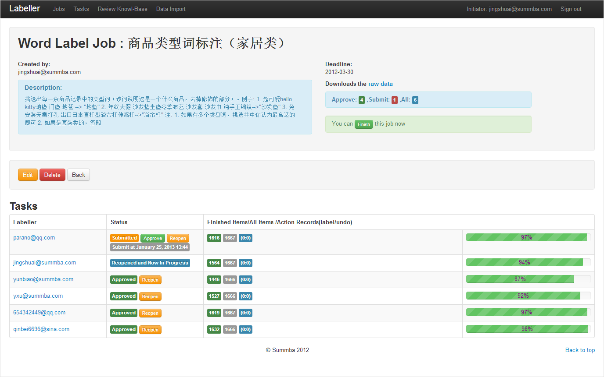
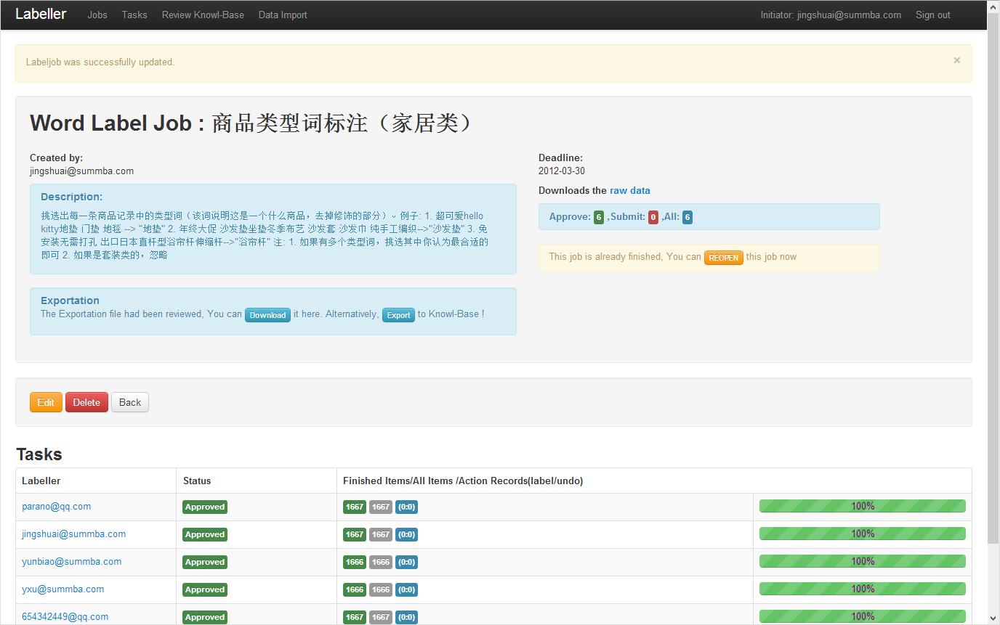
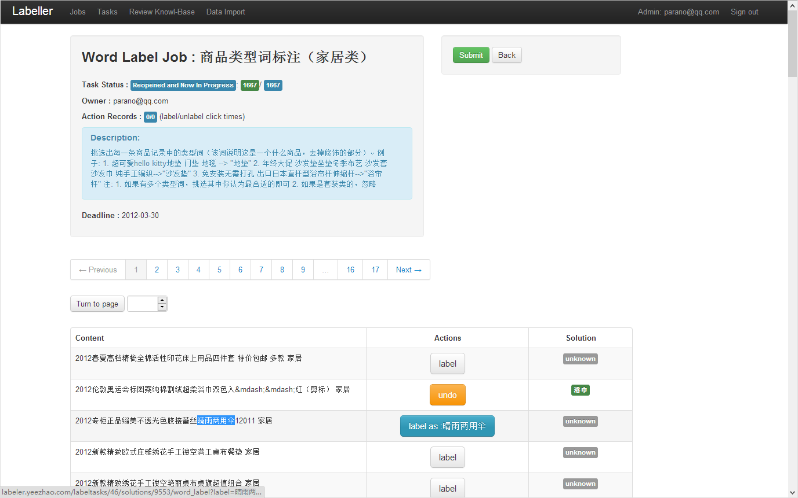
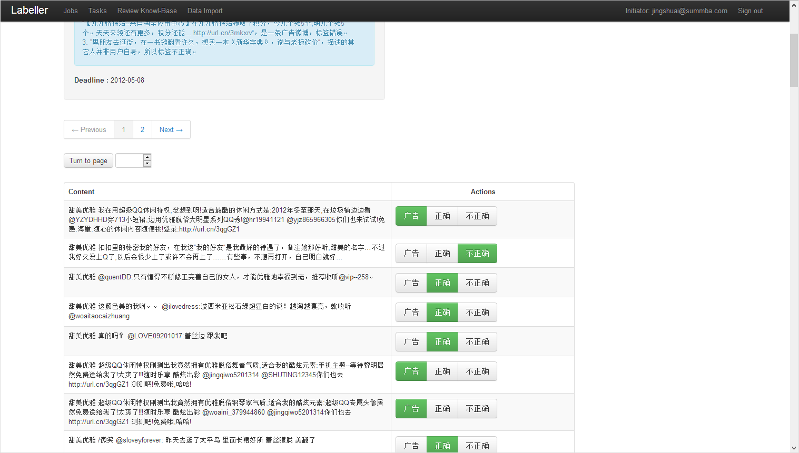
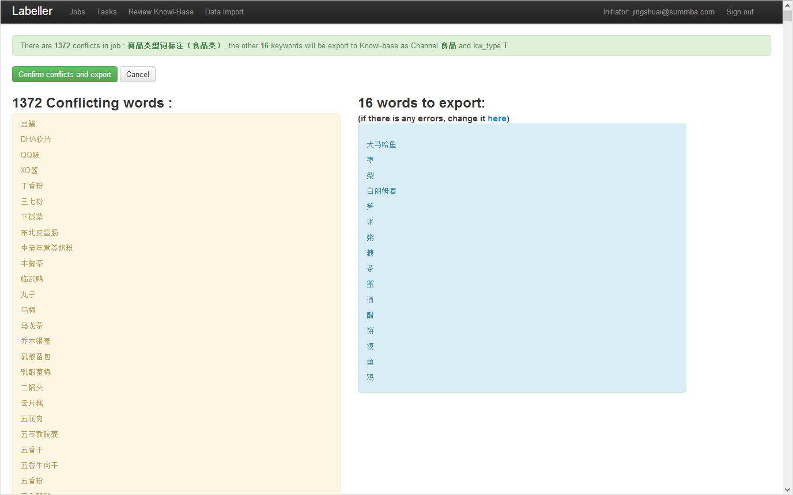
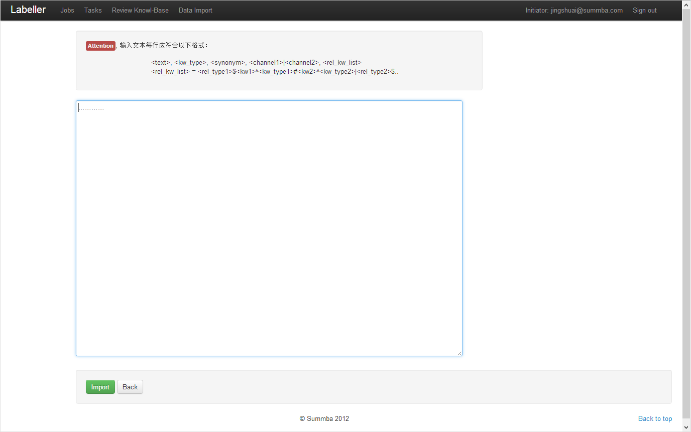
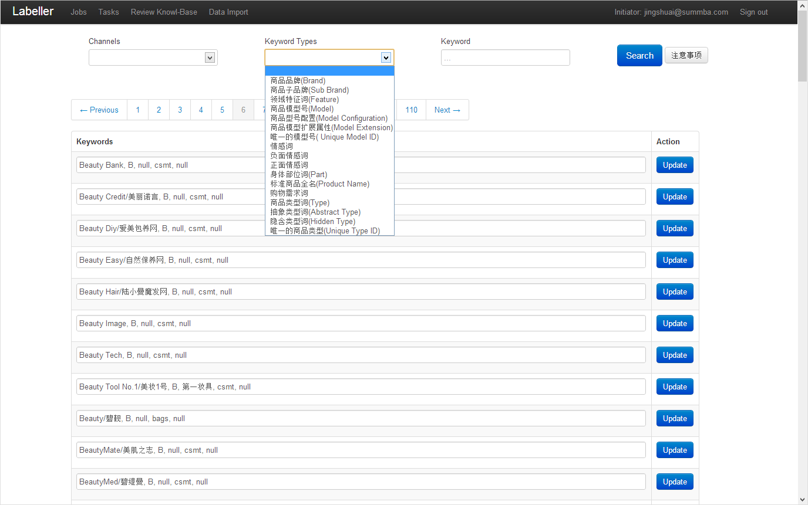

# Labeller

Labeller is an __online collaboration tool for labelling large scale text data__. It is designed for researchers in Machine Learning, NLP or related area, to assigned text labelling task to a group of people and allow them to manage the process.

The Labeller system helped in building the Yeezhao Knowledge Base system. A querying language for creating and editing the terms in the system and their relations is also implemented and integrated in the Labeller system.

I developed this project in early 2012 during my internship at Summba Inc, a startup company providing social media data analysis service in Guangzhou, China. [Prof. Arber Xu](http://ss.sysu.edu.cn/~xyb/), the co-founder of this company, guided me in developing Labeller.

This project is based on __Ruby on Rails 3.2__, __jQuery__, and __MySQL__.

## More About Labeller

The user of this system can create text labelling job via uploading the text file, setting labelling rules, and assigning labelling tasks to selected labllers in this system. For a labelling job in progress, the owner can manage the progress using the dashboard interface:

The labelleing job owner can exam and review all the tasks being assigned to other people. After approving all the assigned tasks, the job will be ended and the owner will be tasked to review the results. 

Two kinds of labelling task are supported by the labeller system. The first one is selecting a piece of text from a paragraph, and click to label the selected string.  

Another kind of labelling task is to classify a paragraph by choosing from some given categroies. The owner of the labelling job need to set up needed categories.

## Integration With Knowledge Base System

All the labelling job could be imported to the Yeezhao Knowledge Base system. It
is designed for solving Natural Language Processing problems in analysising
social media content. This is the inteface for importing results from labelling
job into the knowledge base system:

We designed a sql-like domain specific language for manipulating the knowledge
base system. It has the following basic form:

`
<text>, <keyword_type>, <synonyms1>|<synonyms2>... , <channel1>|<channel2>..., <relation_keyword_list>
<relation_keyword_list> = <relation_type1>$<keyword1>^<keyword_type1>#<kw2>^<kw_type2>|<relation_type2>...
`

The manager of the system can use program generated script to perform large patch task of importing or editing the knowledge base through the following interface:

The system also provided an easy-to-use interface for managing and searching terms and relations in this system using ther search interface. It also support performing the querying language on single term.

To accelerate the labelling process, Labeller system support filtering the uploaded text file based on the current knowledge base system, and automatically update the labels on existing text datasets during the labelling process.

